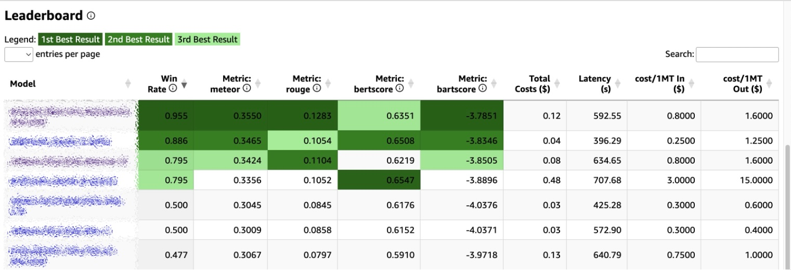

<h1 align="center">
FM-Leaderboard-er 
</h1>
<p align="center">
  <i align="center">Create your own private LLM leaderboard! 📊 
  </i>
</p>


## Introduction
There's no one-fit-all leaderboard. `FM-Leaderboard-er` will allow you to find the best LLM for your own business use case based on your own tasks, prompts, and data. 

## Features:
1. *Tasks* - Example notebooks for common tasks like Summarization, Classification, and RAG (coming soon).
2. *Models* -  Amazon Bedrock, OpenAI, any API (with a code integration).
3. *Metrics* - Built-in metrics per task + custom metrics (via a code integration).
4. *Latency* - Latency metric per model
5. *Cost* - comparison.
6. *Prompt* - You could compare several prompts across one model

## Getting Started
### Prerequisits
1. AWS account with Amazon Bedrock access to selected models.

### Installation
1. Clone the repository:
   ```
   git clone https://github.com/aws-samples/fm-leaderboarder.git
   ```
### Usage

To get started, open the [example-1 notebook](./summariziation_example.ipynb) and follow the instructions provided.

### Architecture
Coming soon.

## Dependency on third party libraries and services
This code can interact with the OpenAI service which has [terms published here](https://openai.com/policies/terms-of-use) and [pricing described here](https://openai.com/pricing). You should be familiar with the pricing and confirm that your use case complies with the terms before proceeding.

This repository makes use of [aws/fmeval Foundation Model Evaluations Library](https://github.com/aws/fmeval). Please review any license terms applicable to the dataset with your legal team and confirm that your use case complies with the terms before proceeding.

## Security

See [CONTRIBUTING](CONTRIBUTING.md#security-issue-notifications) for more information.

## Contributing

Contributions to FM-Leaderboarder are welcome! Please refer to the [CONTRIBUTING.md](CONTRIBUTING.md) file for guidelines on how to contribute.

## Contributors

[//]: contributor-faces

<a href="https://github.com/gilinachum"></a>
<a href="https://github.com/gabishalev"></a>
<a href="https://github.com/LorenzoBoccaccia"></a>
<a href="https://github.com/doronbl"></a>


## License

This project is licensed under the Apache-2.0 License.

